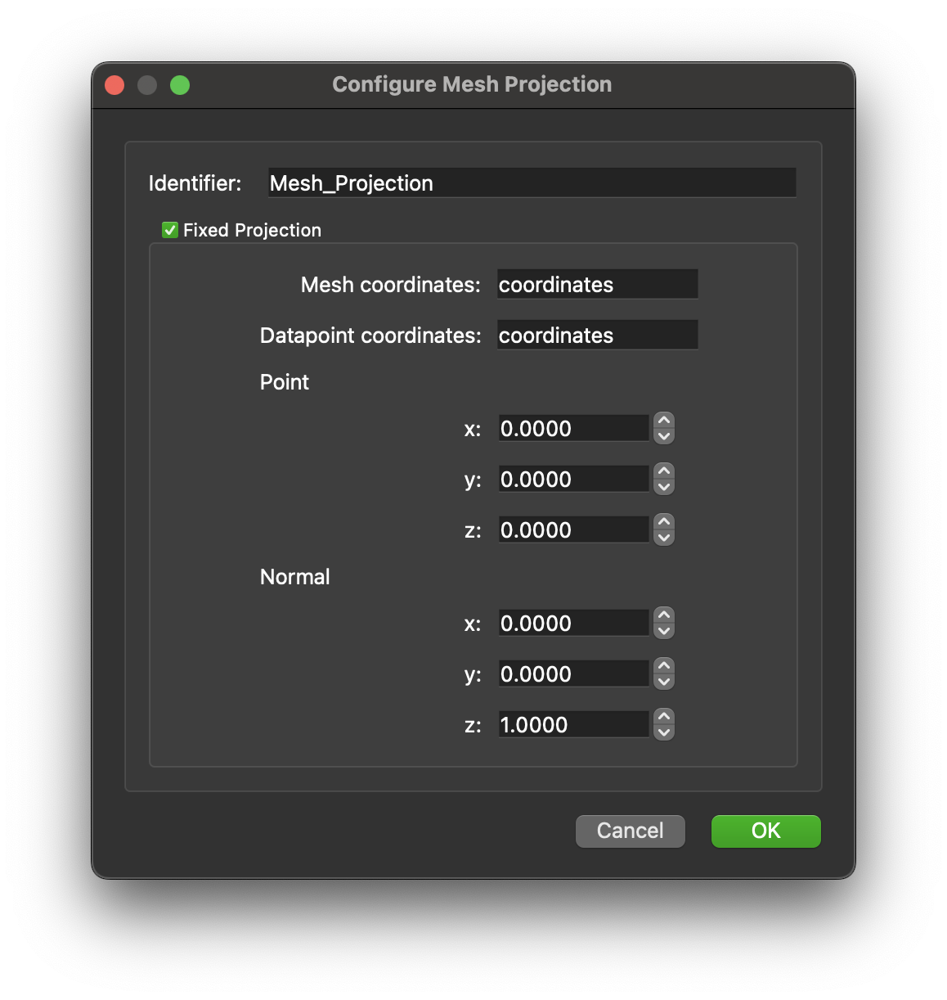

.. _mcp-mesh-projection-configuration:

Configuration
=============

This dialog allows you to configure the step identifier and several projection-related settings.

Available Options
-----------------

1. **Step Identifier**

   You can set the step identifier directly in this configuration dialog.

2. **Output Final Projection in the X-Y Plane**

   Enabling this option applies a final rotation to the data so that:

   - The position data is aligned with the first (X) and second (Y) coordinates.
   - The third (Z) coordinate is effectively zero.

3. **Fixed Projection**

   To enable a fixed projection:

   - Check the corresponding checkbox in the panel.
   - Configure the available properties listed below.

   **Configurable Properties:**

   - Mesh coordinates
   - Data point coordinates
   - Point attributes of the plane description
   - Normal attributes of the plane description

   **Notes:**

   - When using the fixed projection option, no additional dialog will be shown to the user.
   - The fixed projection is independent of the non-fixed or user-defined projection options. These methods do not interfere with each other.

.. _fig-mesh-projection-configuration:

   **Mesh Projection** configuration interface with fixed projection enabled and the properties set at their default values.
