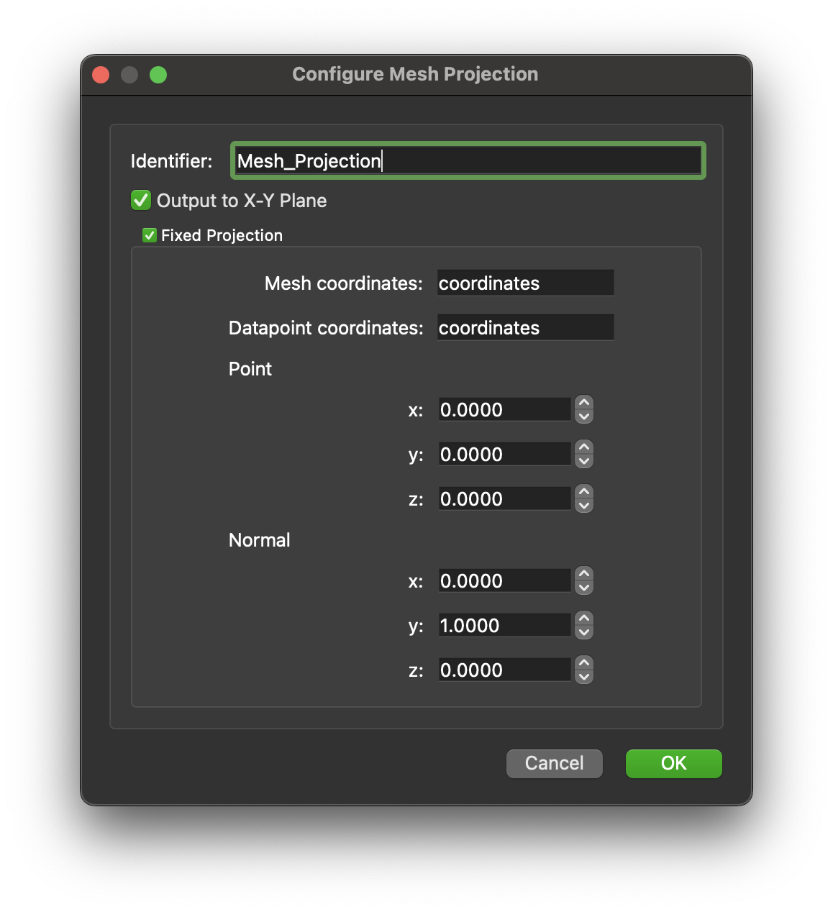

.. _mcp-mesh-projection-configuration:

Configuration
-------------

This step identifier can configured in the configuration dialog along with setting a fixed projection.

The fixed projection is set by checking the check box for the panel and setting the available properties.
The properties that can be set are:

 * The mesh coordinates,
 * The datapoints coordinates,
 * The point attributes of the plane description, and
 * The normal attributes of the plane description.

Using the fixed projection option will not show a dialog to the user.
The fixed projection does not affect the non-fixed projection or user defined projection.
The two ways of defining the projection are entirely independent.

.. _fig-mesh-projection-configuration:

   **Mesh Projection** configuration interface with fixed projection enabled and the properties set at their default values.
